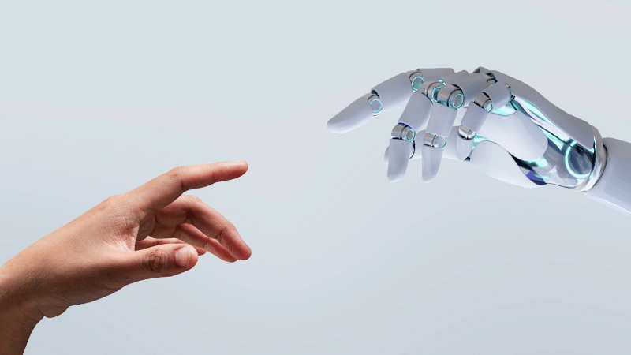

# Robótica y Visión Artificial 4ºESO

Bienvenidos a mi cuaderno de ingeniería para la asignatura de Robótica y Visión Artificial de 4º de ESO. En este repositorio voy a recopilar, redactar y reflejar todo lo que vayamos viendo durante el curso en esta asignatura. Para ello, se han creado distintas subcarpetas con contenido relacionado con cada uno de los proyectos que vamos a ver. A continuación, una tabla con los enlaces a los proyectos:

| Nombre del proyecto | Imagen relacionada | Enlace a la carpeta |
| --- | --- | --- |
| `Pasos previos` | --- | [Pincha aquí](https://github.com/nitropungos3000/Robotica-Y-Vision-Artificial-4-ESO/tree/main/1.%20Pasos%20previos) |
| --- | --- | --- |
| --- | --- | --- |
| --- | --- | --- |
| --- | --- | --- |
| --- | --- | --- |
